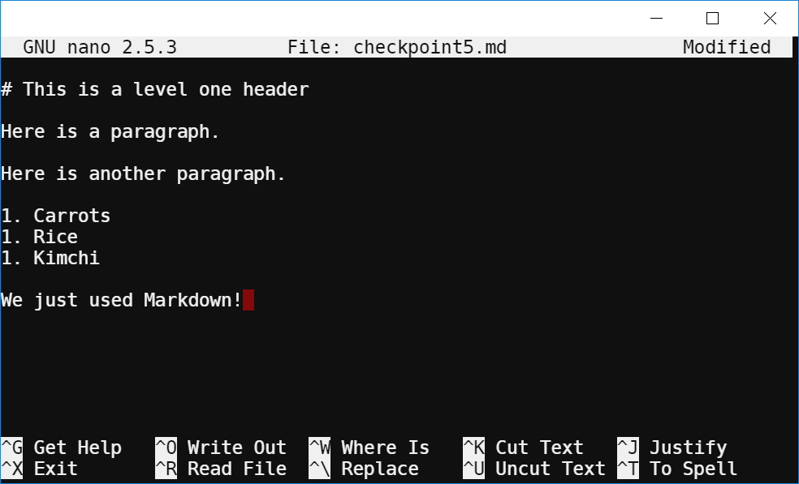
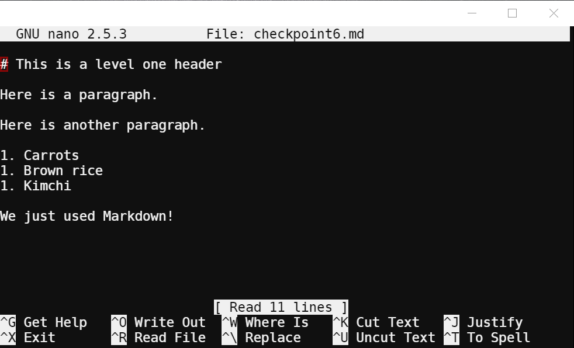

# Using Nano

You'll need to use your OpenBSD 6.3 VM for this lesson. Boot it up and log into the csp user.

## Checkpoint 1: Launching Nano

There are three ways to launch Nano. The first is launching it with only
the `nano` command. The second is launching it and simultaneously creating
a new file. The third is launching it and editing an existing file.

Open the terminal. Type `nano` without any arguments or flags and press
Enter. You should see this:

{width="800" height="485"}

Close Nano by pressing Control-X. Now, type `nano foo.md` and press
Enter. You should see this:

{width="800" height="485"}

You can see at the top of the terminal that the file name is listed.
Type in a sentence or two and then close Nano by pressing Control-X.
This time, Nano will ask you to confirm your changes by pressing Y, or
discard them by pressing N. You can cancel by pressing Control-C. Save
your changes and confirm the filename by pressing Enter.

Now type `nano foo.md` and press Enter. You should see the same file
again. Add a new line at the bottom of the file and type
`I've completed Checkpoint 1`. The close the file by pressing Control-X.
Press Y, but this time change the name of the file to `checkpoint1.md`
before you press Enter.

Stream the contents of the new file to your terminal using `cat` and
then raise your hand.

Raise your hand and have Mr. Olinda verify this checkpoint. Alternatively, you may record your screen as you complete each step from this checkpoint and submit the videos for credit.

## Checkpoint 2: Saving

Open `foo.md` in nano and delete all the text inside. Then press
Control-O to save the file without closing it. If you've done this
correctly, your screen should look like this:

{width="800" height="485"}

Raise your hand and have Mr. Olinda verify this checkpoint. Alternatively, you may record your screen as you complete each step from this checkpoint and submit the videos for credit.

## Checkpoint 3: Read File

You should still have `foo.md` open from the last checkpoint. If not,
open it now. Then press Control-R to read another file and insert it
into the current file. Type in `checkpoint1.md` when it prompts you and
press Enter. Now `foo.md` contains the exact contents of
`checkpoint1.md`.

{width="800"
height="485"}

What happens if you run this command on a file that's not empty? Go
ahead and exit Nano, and be sure to save your changes.

Raise your hand and have Mr. Olinda verify this checkpoint. Alternatively, you may record your screen as you complete each step from this checkpoint and submit the videos for credit.

## Checkpoint 4: Getting Help\

Open Nano and press Control-G. This takes you to the manual for the
program if you ever need to reference it while you're working. Skim
through the whole file before moving on.

Raise your hand and have Mr. Olinda verify this checkpoint. Alternatively, you may record your screen as you complete each step from this checkpoint and submit the videos for credit.

## Checkpoint 5: Copy, Cut, and Paste

Type the following, including blank lines, into a new file called
`checkpoint5.md`:

{width="800" height="485"}

Now, move your cursor to the beginning of one of the numbered lines
using the arrow keys. Press Control-K to cut the line. Then move your
cursor somewhere else in the list and press Control-U to uncut (paste)
the text in. Try this in other places until you're comfortable, and then
move everything back to the original layout.

Then press Alt-A (Alt is the Meta key in Nano) to start highlighting,
and then use the arrow keys to move around and highlight text. Then
press Alt-6 to copy the highlighted text. Go ahead and paste it
somewhere else. Then remove the extra text using Control-K until the
file looks like the original. Exit and save.

Raise your hand and have Mr. Olinda verify this checkpoint. Alternatively, you may record your screen as you complete each step from this checkpoint and submit the videos for credit.

## Checkpoint 6: Find and Replace

Open a new file in Nano called `checkpoint6.md` and use Control-R to read
the contents of `checkpoint5.md` into it. Then save the file. Now, press
Control-W and find the word "rice" in the file. You'll notice that once
you press Enter the cursor moves to the beginning of the word you
searched for. Try this with several different words.

Now use Control-\\ to search for a word and then replace it. In this
case, we will search for the word "Rice" and replace it with the words
"Brown rice". Try doing this with several other words.

Now do a search for the word "Here" and replace it with "There". But
this time, instead of just confirming the change, we want to press A to
change all occurrences of "Here" at the same time.

{width="800" height="486"}

Notice that your last search is saved every time you search, so you can
just press enter to do the same search again. Then save and exit.

Raise your hand and have Mr. Olinda verify this checkpoint. Alternatively, you may record your screen as you complete each step from this checkpoint and submit the videos for credit.

## Study Tips

1.  Understand how to use all of the commands at the bottom of the Nano
    interface and know how to look for help in the Nano help file.
2.  Understand how to create, open, edit, and save text files using
    Nano.\

